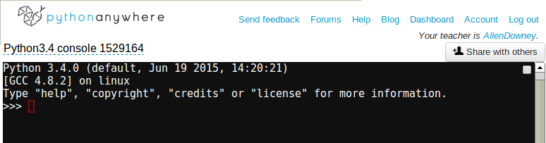
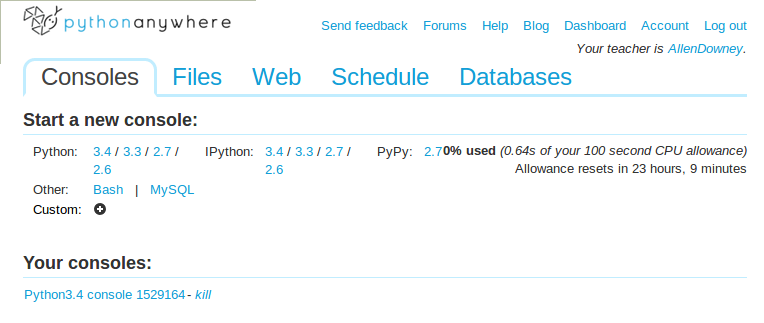
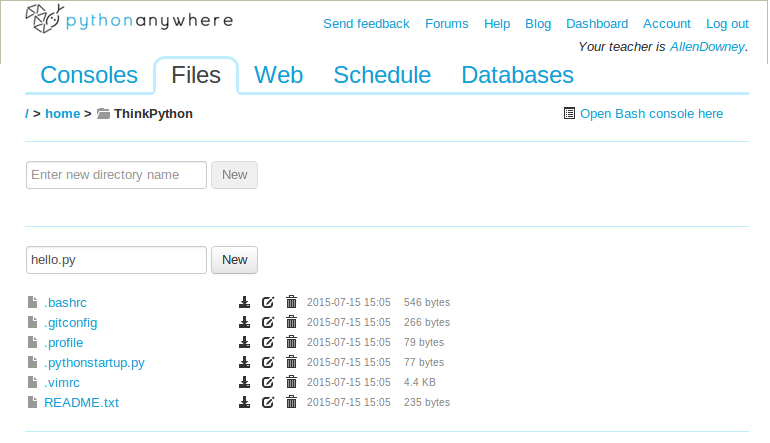
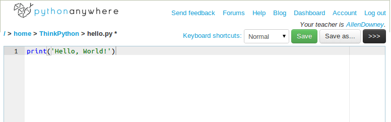

# 1 - O caminho do programa {#sec1}

[TOC]

O objetivo deste livro é te ensinar a pensar como um cientista da computação. Esta maneira de pensar combina algumas das melhores características de matemática, engenharia, e ciências naturais. Como matemáticos, cientistas da computação usam linguagens formais para denotar ideias (em particular, computações). Como engenheiros, eles projetam coisas, unindo componentes em sistemas e avaliando um compromisso entre alternativas. Como cientistas, eles observam o comportamento de sistemas complexos, formam hipóteses, e averiguam previsões.

A habilidade mais importante para um cientista da computação é a **solução de problemas**. A aptidão de resolver problemas é poder formular problemas, pensar criativamente em soluções, e expressar uma solução claramente e precisamente. De fato, o processo de aprendizagem a programar é uma oportunidade excelente para aprimorar a capacidade de resolver problemas. É por isso que este capítulo é chamado "O caminho do programa".

Em um nível, você aprenderá a programar, que é por si, uma habilidade útil. Num outro nível, você utilizará programação como um meio para atingir um fim. A medida que progredirmos, esse fim ficará mais claro.

# 1.1 O que é um programa? {#sec1_1}

Um **programa** é uma sequência de instruções que especifica como realizar uma computação. A computação pode ser algo matemático, como resolver um sistema de equações ou encontrar as raízes de um polinomial, mas também pode ser uma computação simbólica, como procurar e substituir texto num documento, ou algo gráfico, como processar uma imagem ou reproduzir um vídeo.

Os detalhes parecem diferentes em linguagens diferentes, mas algumas instruções básicas estão presentes em quase todas as linguagens:

**entrada:** Obter dados pelo teclado, um arquivo, a rede, ou outro dispositivo.

**saída:** Exibir dados na tela, gravá-los num arquivo, transmiti-los pela rede, etc.

**matemática:** Realizar operações básicas de matemática como adição e multiplicação.

**execução condicional:** Verificar certas condições e executar o código apropriado.

**repetição:** Executar alguma ação repetidamente, geralmente com alguma variação.

Acredite se quiser, mas isto é praticamente tudo que há. Todo programa que você já tem utilizado, não importe o quanto complicado que seja, é feita de instruções que se parecem como esses. Então, você pode pensar sobre programação como o processo de separar uma tarefa grande e complexa em subtarefas cada vez menores até que as subtarefas sejam simples suficientes a poder serem efetuadas com uma dessas instruções básicas.

# 1.2 Executando Python {#sec1_2}

Um dos desafios de começar a usar Python é que você possivelmente terá que instalá-lo e outros softwares relacionados no seu computador. Se você tem um bom conhecimento do seu sistema operacional, e particularmente, se você se sente confortável com o interface de linha de comando, você não terá dificuldades pra instalar Python. Mas para iniciantes, pode ser doloroso ter que aprender administração de sistemas e programação ao mesmo tempo.

Para evitar este problema, recomendo que comece executando Python num navegador. Depois, quando se sentir confortável com Python, farei sugestões de como instalar Python no seu computador.

Existem vários websites que você pode usar para executar Python. Se você já tem um preferido, vá em frente e use-o. Senão, eu recomendo PythonAnywhere.

A subseção 1.2.1 explica em detalhe como começar a usar Python, e é uma adaptação das [instruções originais, que podem ser atualizadas futuramente.](http://www.allendowney.com/wp/books/think-python-2e/)

Para iniciantes, recomendo começar com os seguintes passos:

1. Usar um serviço online de "Python num navegador" como [PythonAnywhere](https://www.pythonanywhere.com/) para executar código Python no modo interativo, que quer dizer que você pode digitar e executar código linha por linha.

2. Ainda rodando Python num navegador, colocar código Python num arquivo, chamado um *script*, e executar o script inteiro.

3. Instalar Python no seu próprio computador.

4. Considerar usar [IPython](http://ipython.org/) e [Jupyter](http://jupyter.org/), um ambiente de desenvolvimento interativo para Python (e outras linguagens)

Se você se sentir confortável instalando coisas no seu computador, vá diretamente à [seção 1.2.1.3](@ref sec1_2_1_3).

# 1.2.1.1 Num navegador, modo interativo {#sec1_2_1_1}

Existem vários sites que te permitem a rodar Python num navegador. Você pode usar qualquer que preferir, mas aqui darei instruções detalhadas para PythonAnywhere.

1) Vá a [pythonanywhere.com](https://www.pythonanywhere.com/) e clique em **Pricing & signup** (Preços e registro) no canto superior direito. Uma conta **Beginner: Free!** (gratuita para iniciantes) é suficiente para começar.

Após criar sua conta, deverá ver uma página como esta:


Um *console* Python é uma janela onde pode executar comandos Python. Os outros consoles te permitem a executar outros tipos de comandos.

2) Em baixo de **Start a new console**, escolha "Python: 3.4", que criará um console novo rodando uma versão atual de Python 3. O resultado deve parecer a:



Na janela preta, as primeiras três linhas contém informações sobre o interpretador Python e o sistema operacional em qual ele roda. A linha seguinte contém uma linha de comando e o sinal de espera, `>>>`, que indica que o interpretador está pronto para que você digite código Python. Você pode digitar qualquer exemplo do livro aqui, e o interpretador executará-los e exibirá os resultados.

3) Agora se clicar em **Dashboard** (Painel) no canto superior direito, você verá o console novo sob **Your consoles**:



Para voltar ao seu console, clique no nome dele, nesse exemplo, "Python 3.4 console 1529164". Você pode manter seus consoles por quanto tempo quiser, mas se quiser apagar um deles, clique em "kill" (matar).

# 1.2.1.2 Num navegador, modo de script {#sec1_2_1_2}

Rodar código Python no modo interativo é uma boa maneira de começar, mas se você está mexendo com mais que algumas linhas de código, pode ser desajeitado.

A alternativa é gravar o código num arquivo chamado **script** e usar o interpretador para executar o conteúdo do script. Eis como fazê-lo em PythonAnywhere.

1) Clique em **Dashboard** (Painel) no canto superior direito e selecione a guia **Files** (Arquivos). Deve parecer a:



Você verá uma lista de arquivos que foram criadas automaticamente.

2) No campo de texto que diz "Enter new file name" (Insira nome de arquivo novo), digite um nome de arquivo como `hello.py`. Por convenção, nomes de arquivos para scripts Python terminam em `.py`. Clique "New" (Novo). O resultado deve parecer a:



A janela principal é um editor onde você pode digitar código Python como no exemplo acima.

O interpretador padrão é Python 2.7. Para escolher Python 3.4, é necessário incluir, como a primeira linha do arquivo, o nome do interpretador Python 3.4:

`#!/usr/local/bin/python3.4`

Quando estiver pronto para executá-lo, clique no botão preto com os três símbolos maior que `>>>`. Na primeira vez que fizer isso, seu navegador talvez perguntará se quer permitir pop-ups para esse site. Diga que sim.

Uma janela nova deverá aparecer, que mostra o resultado do seu programa. Agora você pode editar e rodar o programa quantas vezes quiser.

Se aparecer o erro "Console limit reached", quer dizer que já existem dois consoles abertos (que é o limite da conta gratuita). Neste caso, clique no link "kill some consoles on your Consoles page" para encerrar um console, e tente novamente. 

3) Quando terminar, feche a janela pop-up e volte à guia "Files" (Arquivos). Você deve ver o arquivo criado na lista. Clique nos ícones para fazer download, editar, ou apagar o arquivo.

Se você voltar à guia "Consoles", você poderá ver um console para o arquivo que editou. Depois de terminar editando o arquivo, pode terminar esse console (mas o arquivo continuará lá).

# 1.2.1.3 Instalando no seu computador {#sec1_2_1_3}

Para Linux, Windows, e Mac, altamente recomendo instalar Anaconda, que é uma distribuição Python que inclui os módulos que você é mais capaz de usar. É fácil de instalar, e porque normalmente instala no seu diretório pessoal, não precisa de privilégios de administrador. Também é de graça.

1) Vá à [página de downloads de Anaconda](http://continuum.io/downloads).

2) Escolha o instalador de Python 3 apropriado para seu sistema.

3) Quando o download completar, abra o instalador (a não ser que já abra automaticamente)

4) O assistente de configuração perguntará algumas informações de configuração. Provavelmente poderá aceitar as opções padrão. Recomendo que deixe o instalador defina o caminho de pesquisa e registre a versão Anaconda de Python, especialmente se você tiver uma versão antiga de Python já instalada.

5) A partir do menu "Iniciar", busque "idle", que é o nome de um ambiente de programação Python simples, incluso na maioria de distribuições Python. Quando você executar IDLE, deve ver uma janela de comando ou "shell" rodando um interpretador Python. Você pode digitar e executar comandos Python nessa janela.

6) Para escrever um script, escolha "New" (Novo) do menu "File" (Arquivo). Digite algum código Python e depois escolha "Save" (Gravar) do menu "File". Escolha um nome pro arquivo e grave-o num local no seu diretório pessoal. (O local padrão pode ser na pasta de scripts da Anaconda).

7) Para executar o script, escolha "Run Module" (Executar módulo) do menu "Run" (Executar), ou pressione F5. Os resultados deverão aparecer na janela de comandos. 

**Solução de problemas**

Se você já tem Python no seu sistema, talvez encontrará problemas se acidentalmente rodar a versão préviamente instalada em vez da versão que acabou de instalar. Para verificar, execute Python ou IDLE e veja a informação de versão que é exibida ao iniciar. Você deve ver uma versão de Python 3 (quando escrevi isto a versão atual era Python 3.4.3), e alguma versão de Anaconda (como 2.3.0). Se não, você não está rodando a versão que acabou de instalar. Nesse caso, você poderá achar e executar a versão correta, alterar o caminho de pesquisa, ou rodar o instalador de novo e deixá-lo alterar o caminho de pesquisa para você. 

# 1.2.1.4 Rodando IPython/Jupyter {#sec1_2_1_4}

Se você instalou Anaconda no passo anterior, você já tem Jupyter, que é um ambiente de desenvolvimento interativo para Python (e outras linguagens). Até recentemente, Jupyter era chamado IPython, então você poderia ver também esse nome.

Do menu "Iniciar", busque IPython. Você pode ver várias opções:

* **IPython** em si executa um interpretador Python com alguns recursos a mais.

* **IPython QTConsole** executa um interpretador Python num ambiente gráfico.

* **IPython Notebook** executa Python rodando num navegador.

Recomendo IPython Notebook. Da linha de comando, pode executar IPython digitando:

`$ ipython notebook`

Leia [mais sobre Jupyter/IPython aqui](https://jupyter.org/)

# 1.2.2 O interpretador Python {#sec1_2_2}

Existem duas versões de Python, chamadas Python 2 e Python 3. São muito parecidos, então se você aprender um deles, é fácil mudar para o outro. De fato, como um iniciante, encontrará apenas poucas diferenças. Este livro foi escrito para Python 3, mas incluo algumas anotações sobre Python 2.

O **interpretador** Python é um programa que lê e executa código Python. Dependendo do seu ambiente, você poderá iniciar o interpretador clicando num ícone, ou digitando `python` numa linha de comando. Quando ele começar, você deve ver a seguinte saída na sua tela:

```
Python 3.4.0 (default, Jun 19 2015, 14:20:21)
[GCC 4.8.2] on linux
Type "help", "copyright", "credits" or "license" for more information.
>>>
```

As primeiras três linhas contém informações sobre o interpretador e o sistema operacional em qual ele roda, então pode ser diferente para você. Mas você deve verificar que o número da versão, que é 3.4.0 neste exemplo, começa com 3, que indica que você está rodando Python 3. Se começar com 2, você está rodando (adivinhou) Python 2.

A última linha é a **linha de comando** que indica que o interpretador está pronto para você inserir código. Se você digitar uma linha de código e teclar Enter, o interpretador exibirá o resultado:

`>>> 1 + 1`

`2` 

Agora está pronto para começar. Daqui pra frente, assumo que você saiba como rodar o interpretador Python e executar código. 

# 1.3 O primeiro programa {#sec1_3}

Tradicionalmente, o primeiro programa que você escreve numa nova linguagem é chamada "Hello, World!" (Alô, Mundo!) porque tudo que ele faz é exibir as palavras "Alô, Mundo!". Em Python, é escrito assim:

```.py
>>> print('Alô, Mundo!')
``` 

Nas listagens de código fonte ou interações com o Python como essa exibida acima, os três símbolos maior que `>>>` representam o sinal de espera do interpretador e não devem ser digitados.

Este é um exemplo de uma **instrução print**, apesar de que não imprima nada em papel. Ele exibe um resultado na tela. Neste caso, o resultado é as palavras

```
Alô, Mundo!
```

As aspas no programa marcam o início e o fim do texto a ser exibido; eles não aparecem no resultado.

Os parênteses indicam que `print` é uma função. Chegaremos a funções no [Capítulo 3](@ref sec3).

Em Python 2, a instrução print é ligeiramente diferente; não é uma função, então não usa parênteses.

`>>> print 'Alô, Mundo!'`

Essa diferença fará mais sentido logo, mas é o suficiente para começar.

# 1.4 Operadores aritméticos {#sec1_4}

Após "Alô, Mundo", o próximo passo é a aritmética. Python disponibiliza **operadores**, que são símbolos especiais que representam cálculos como adição e multiplicação.

Os operadores `+`, `-`, e `*` realizam adição, subtração, e multiplicação, como nos seguintes exemplos:

```.py
>>> 40 + 2
42
>>> 43 - 1
42
>>> 6 * 7
42
```

O operador `/` realiza divisão:

```.py
>>> 84 / 2
42.0
```

Você pode perguntar por que o resultado é `42.0` em vez de `42`. Explicarei na próxima seção.

Finalmente, o operador `**` realiza exponenciação; isto é, eleva um número a uma potência:

```.py
>>> 6**2 + 6
42
```

Em algumas outras linguagens, `^` é usada para exponenciação, mas em Python ele é um operador bit a bit chamado XOR. Se você não estiver acostumado com operadores bit a bit, o resultado de surpreenderá:

```.py
>>> 6 ^ 2
4
```

Não incluirei operadores bit a bit neste livro, mas você pode ler sobre eles em [http://wiki.python.org/moin/BitwiseOperators](http://wiki.python.org/moin/BitwiseOperators).

# 1.5 Valores e tipos {#sec1_5}

Um **valor** é uma das coisas básicas com qual um programa trabalha, como uma letra ou um número. Alguns dos valores que temos vistos até agora são `2`, `42.0`, e `'Alô, Mundo!'`.

Esses valores pertencem a **tipos** diferentes: `2` é um **inteiro**, `42.0` é um **número de ponto flutuante**, e `'Alô, Mundo!'` é uma **string** (*cadeia*, ou *corda* em inglês), chamado assim porque as letras que ela contém são ligadas juntas numa cadeia.

Se você não tem certeza de qual tipo um valor tem, o interpretador pode te dizer:

```.py
>>> type(2)
<class 'int'>
>>> type(42.0)
<class 'float'>
>>> type('Alô, Mundo!')
<class 'str'>
```

Nesses resultados, a palavra *class* é usada no sentido de uma *categoria*; um tipo é uma categoria de valores.

Não é de surpreender que inteiros pertencem ao tipo *int*, strings a *str*, e números de ponto flutuante pertencem a *float*.

E valores como `'2'`e `'42.0'`? Eles parecem números, mas estão entre aspas como strings.

```.py
>>> type('2')
<class 'str'>
>>> type('42.0')
<class 'str'>
```

São strings.

Quando você digita um inteiro grande, você talvez queira usar pontos entre grupos de dígitos, como `1.000.000`. Isto não é sintaxe considerado válido por Python.

Um número inteiro deve consistir somente de dígitos. Um número pode ter um ponto como separador decimal, que separa a parte inteira da parte fracionária. O exemplo `1.000.000`, não é válido porque tem dois pontos, e algo como `1.500` será interpretado como um e meio (1.5), não mil e quinhentos.

Separar as partes de um número com uma vírgula em vez de um ponto é sintaticamente aceita por Python, mas não é o valor que espera.

```.py
>>> 4,2
(4, 2)
>>> type((4, 2))
<class 'tuple'>
```

Python interpreta `4,2` como uma sequência de inteiros separada por vírgulas. Aprenderemos mais sobre esse tipo de sequência mais tarde.

# 1.6 Linguagens formais e naturais {#sec1_6}

*Linguagens naturais* são as línguas que pessoas falam, como inglês, espanhol, e francês. Não foram concebidas por pessoas (apesar que as pessoas tentam impor ordem nelas); evoluiram naturalmente.

*Linguagens formais* são linguagens que são projetadas por pessoas para aplicações específicas. Por exemplo, a notação que matemáticos usam é uma linguagem formal que é especialmente boa em denotar relações entre números e símbolos. Químicos usam uma linguagem formal para representar a estrutura química de moléculas. E mais importante,

**Linguagens de programação são linguagens formais que foram projetadas para expressar computações.**

Linguagens formais tendem a ter regras rigorosas de sintaxe que controlam a estrutura de declarações e expressões. Por exemplo, em matemática a expressão 3 + 3 = 6 tem sintaxe correta, mas 3+ = 3$6 não. Na química, H<sub>2</sub>O é uma fórmula sintaticamente correta, mas <sub>2</sub>Zz não é.

Existem dois tipos de regras de sintaxe, referentes a **tokens** (símbolos) e a estrutura. Tokens são elementos básicos da linguagem, como palavras, números, e elementos químicos. Um dos problemas com 3+ = 3$6 é que `$` não é um token legal em matemática (pelo menos que eu saiba). Semelhantemente, <sub>2</sub>Zz não é legal porque não existe nenhum elemento com a abreviação Zz.

O segundo tipo de regra de sintaxe diz respeito à maneira que tokens são combinados. A equação 3+ = 3 é ilegal porque apesar que + e = sejam tokens legais, não se pode combinar um seguido de um outro. Semelhantemente, numa fórmula química, o subscrito vem depois do nome do elemento, e não antes.

Est@ é uma $entença bem estruturada com t*kens inválidos nele. Esta sentença todas válidas tokens tem, mas estrutura inválida com.

Quando você lê uma sentença em português ou uma expressão numa linguagem formal, você tem que compreender a sua estrutura (mas numa linguagem natural você o faz subconscientemente). Este processo se chama **análise sintática** (parsing).

Apesar que linguagens formais e naturais hajam muitas características em comum--tokens, estrutura, e sintaxe--existem algumas diferenças:

**ambiguidade:** Linguagens naturais estão cheias de ambiguidade, com qual as pessoas lidam usando dicas contextuais e outras informações. Linguagens formais são projetadas para ser quase ou totalmente inequívocas, que significa que qualquer expressão tenha exatamente um significado, independentemente de contexto.

**redundância:** Para compensar pela ambiguidade e para diminuir mal-entendidos, linguagens naturais utilizam muitas redundâncias. Como resultado, geralmente são verbosas. Linguagens formais são menos redundantes e mais concisas.

**literalidade:** Linguagens naturais são cheias de expressões idiomáticas e metáforas. Se eu digo, "a ficha caiu", provavelmente não haja ficha nenhuma e nada caindo (essa expressão significa que alguém entendeu algo depois de um período de confusão). Linguagens formais significam exatamente o que querem dizer.

Porque todos nós crescemos falando linguagens naturais, às vezes é difícil nos ajustar a linguagens formais. A diferença entre uma linguagem formal e natural é como a diferença entre poesia e prosa, só que mais ainda:

**Poesia:** Palavras são usadas tanto pelos seus sons quanto para seu significado, e o poema inteiro cria um efeito ou reação emocional. Ambiguidade não é só comum, mas frequentemente usada de propósito.

**Prosa:** O significado literal das palavras é mais importante, e a estrutura contribui mais ao significado. Prosa é mais favorável à análise, mas ainda frequentemente ambígua.

**Programas:** O significado de um programa de computador é sem ambiguidade e literal, e pode ser compreendida completamente pela análise dos tokens e da estrutura.

Linguagens formais são mais densas que linguagens naturais, então demoram mais para ser lidas. Além disso, a estrutura é importante, então nem sempre é melhor ler de cima pra baixo, de esquerda a direita. Em vez, aprenda a analisar o programa na sua cabeça, identificando os tokens e interpretando a estrutura. Finalmente, os detalhes importam. Pequenos erros de digitação e pontuação, de quais você pode se safar em linguagens naturais, podem fazer uma grande diferença numa linguagem formal.

# 1.7 Depuração {#sec1_7}

Programadores fazem erros. Por motivos caprichosos, erros de programação são chamados **bugs** (literalmente, insetos) e o processo de detectá-los, **debugging** (depuração).

Programação, e em particular, depuração, podem trazer fortes emoções à superfície. Se você estiver tendo dificuldades com um bug complicado, você pode sentir bravo, desanimado, ou constrangido.

Há evidência que pessoas naturalmente respondem a computadores como se fossem pessoas. Quando funcionam bem, pensamos deles como colegas de equipe, e quando são teimosos ou grosseiros, respondemos a eles da mesma maneira que respondemos a pessoas teimosas e grosseiras (Reeves e Nass, *The Media Equation: How People Treat Computers, Television, and New Media Like Real People and Places*) (A Equação da Mídia: Como Pessoas Tratam Computadores, Televisão, e Novas Mídias Como Pessoas e Lugares de Verdade).

Preparar-se para essas reações poderá te ajudar a lidar com eles. Um método é considerar o computador como um empregado com certos pontos fortes, como velocidade e precisão, e pontos fracos particulares, como a falta de empatia e incapacidade de captar a perspectiva geral.

Seu trabalho é ser um bom gerente: encontrar maneiras de aproveitar os pontos fortes e atenuar os pontos fracos. E encontrar maneiras de usar suas emoções para empenhar-se com o problema, sem deixar suas reações interferir com sua abilidade de trabalhar eficientemente.

Aprender a depurar pode ser frustrante, mas é uma habilidade valiosa para muitas atividades além de programação. No final de cada capítulo tem uma seção, como esta, com minhas sugestões para depuração. Espero que ajudem!

# 1.8 Glossário {#sec1_8}

**solução de problemas:** O processo de formular um problema, achar uma solução, e expressá-la.

**linguagem de alto nível:** Uma linguagem de programação como Python que é projetada para ser fácil para humanos lerem e escreverem.

**linguagem de baixo nível:** Uma linguagem de programação que é projetada para ser fácil pra um computador executar; também chamado "linguagem de máquina" ou "linguagem de montagem".

**portabilidade:** A propriedade de um programa que pode ser executada em mais que um tipo de computador.

**interpretador:** Um programa que lê um outro programa e o executa.

**sinal de espera:** Caracteres exibidos pelo interpretador para indicar que está pronto para aceitar a entrada do usuário.

**programa:** Uma série de instruções que especifica uma computação.

**instrução print** (literalmente, *imprimir*):  Uma instrução que causa o interpretador Python a exibir um valor na tela.

**operador:** Um símbolo especial que representa uma computação simples como adição, multiplicação, ou concatenação de strings.

**valor:** Uma das unidades básicas de dados, como um número ou uma string, que um programa manipula.

**tipo:** Uma categoria de valores. Os tipos que vimos até agora são inteiros (tipo `int`), números de ponto flutuante (tipo `float`), e strings (tipo `str`).

**inteiro:** Um tipo que representa números inteiros.

**ponto flutuante:** Um tipo que representa números com partes fracionárias.

**string:** Um tipo que representa sequências de caracteres.

**linguagem natural:** Qualquer uma das línguas que pessoas falam que evoluíram naturalmente.

**linguagem formal:** Qualquer uma das linguagens que pessoas projetaram para fins específicos, tal como representar ideias matemáticas ou programas de computador; todas as linguagens de programação são linguagens formais.

**token:** Um dos elementos básicos da estrutura sintática de um programa, análogo a uma palavra numa linguagem natural.

**sintaxe:** As regras que controlam a estrutura de um programa.

**analisar sintaticamente:** Examinar um programa e analisar a estrutura sintática.

**bug:** Um erro num programa.

**depuração:** O processo de encontrar e corrigir bugs.

# 1.9 Exercícios {#sec1_9}

**Exercício 1.1.** É uma boa ideia ler este livro na frente de um computador para que possa testar os exemplos enquanto avance.

Quando estiver experimentando um recurso novo, você deve tentar fazer erros. Por exemplo, no programa "Alô, Mundo!", o que acontece se omitir uma das aspas? O que acontece se omitir os dois? E se você soletrar `print` incorretamente?

Esse tipo de experiência te ajuda a lembrar o que você leu; te ajuda também quando programa, porque você aprende o que as mensagens de erro significam. É melhor errar agora e de propósito do que depois, e sem querer.

1. Numa instrução print, o que acontece se você omitir um dos parênteses, ou ambos?

2. Se você quiser exibir uma string, o que acontece se omitir uma das aspas, ou ambas?

3. Você pode usar o sinal de menos para fazer um número negativo, como -2. O que acontece se pôr um sinal de mais antes de um número? E que tal 2++2?

4. Em notação matemática, zeros à esquerda estão tudo bem, como `02`. O que acontece se tentar isso em Python?

5. O que acontece se tiver dois valores sem nenhum operador entre eles?

**Exercício 1.2.** Execute o interpretador Python e use-o como uma calculadora.

1. Quantos segundos tem 42 minutos e 42 segundos?

2. Quantas milhas tem 10 quilômetros? Dica: tem 1,61 quilômetros em uma milha.

3. Se você correr uma corrida de 10 km em 42 minutos e 42 segundos, qual é o seu ritmo médio em milhas (tempo por milha em minutos e segundos)? Qual é a sua velocidade média em milhas por hora?

[Próxima página >>](@ref sec2)

