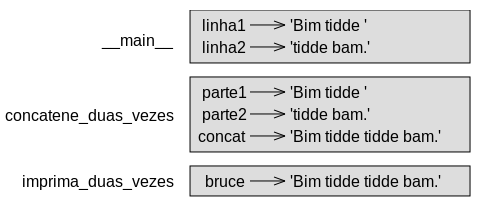

# 3 - Funções {#sec3}

[TOC]

No contexto de programação, uma **função** é uma sequência nomeada de instruções que realizam uma computação. Quando você define uma função, voce especifica o nome e a sequência de instruções. Depois, você pode "chamar" a função pelo nome.

# 3.1 Chamadas de funções {#sec3_1}

Já vimos um exemplo de uma **chamada de função**:

```.py
>>> type(42)
<class 'int'>
```

O nome da função é `type`. A expressão em parênteses é chamada o **argumento** da função. O resultado, para essa função, é o tipo do argumento.

É comum dizer que uma função "recebe" um argumento e "devolve", ou "retorna", um resultado. O resultado é também chamado o **valor devolvido**.

Python fornece funções que convertem valores de um tipo para outro. A função `int` recebe qualquer valor e o converte para um inteiro, se puder, caso contrário, se queixa.

```.py
>>> int('32')
32
>>> int('Hello')
ValueError: invalid literal for int(): Hello
[ErroDeValor: literal inválido para int(): Hello]
```

`int` pode converter valores de ponto flutuante para inteiros, mas não arredonda; corta a parte fracional:

```.py
>>> int(3.99999)
3
>>> int(-2.3)
-2
```

`float` converte inteiros e strings para números de ponto flutuante:

```.py
>>> float(32)
32.0
>>> float('3.14159')
3.14159
```

Finalmente, `str` converte seu argumento para uma string:

```.py
>>> str(32)
'32'
>>> str(3.14159)
'3.14159'
```

# 3.2 Funções matemáticas {#sec3_2}

Python tem um módulo de matemática que fornece a maioria das funções matemáticas familiares. Um **módulo** é um arquivo que contém uma coleção de funções relacionadas.

Antes que possamos usar as funções num módulo, devemos importá-la com uma **instrução import**:

```.py
>>> import math
```

Essa instrução cria um **objeto-módulo** chamado `math`. Se você pedir pra exibir o objeto-módulo, você receberá alguma informação sobre ele:

```.py
>>> math
<module 'math' (built-in)>
```

O objeto-módulo contém as funções e variáveis definidos no módulo. Para acessar uma das funções, você precisa especificar o nome módulo e o nome da função, separada por um ponto. Esse formato é chamado **notação de ponto**.

```.py
>>> razão = potência_de_sinal / potência_de_ruído
>>> decibéis = 10 * math.log10(razão)

>>> radianos = 0.7
>>> altura = math.sin(radianos)
```

O primeiro exemplo usa `math.log10` para calcular a razão sinal-ruído em decibéis (assumindo que `potência_de_sinal` e `potência_de_ruído` são definidas). O módulo `math` também fornece `log`, que calcula logaritmos base `e`.

O segundo exemplo calcula o seno de `radianos`. O nome do variável é uma dica que `sin` e as outras funções trigonométricas (`cos`, `tan`, etc.) recebem argumentos em radianos. Para converter graus em radianos, divida por 180 e multiplique por π:

```.py
>>> graus = 45
>>> radianos = graus / 180.0 * math.pi
>>> math.sin(radianos)
0.707106781187
```

A expressão `math.pi` obtém o variável `pi` do módulo `math`. Seu valor é uma aproximação de ponto flutuante de π, com precisão de 15 dígitos.

Se você sabe trigonometria, pode verificar o último resultado comparando-o com a raíz quadrada de dois dividido por dois:

```.py
>>> math.sqrt(2) / 2.0
0.707106781187
```

# 3.3 Composição {#sec3_3}

Até agora, vimos os elementos de um programa--variáveis, expressões, e instruções--em isolamento, sem falar sobre como combiná-los.

Uma das mais úteis características de linguagens de programação é sua habilidade de tomar pequenos elementos e **compor**-os. Por exemplo, o argumento de uma função pode ser qualquer tipo de expressão, incluindo operadores aritméticos:

```.py
x = math.sin(graus / 360.0 * 2 * math.pi)
```

E até chamadas de funções:

```.py
x = math.exp(math.log(x+1))
```

Em quase qualquer lugar que possa pôr um valor, pode pôr uma expressão arbitrária, com uma exceção: o lado esquerdo de uma instrução de atribuição tem que ser um nome de variável. Qualquer outra expressão no lado esquerdo é um erro de sintaxe (veremos exceções a essa regra depois).

```.py
>>> minutos = horas * 60       # correto
>>> horas * 60 = minutos       # errado!
SyntaxError: can't assign to operator
[ErroDeSintaxe: não é possível atribuir a um operador]
```

# 3.4 Adicionando funções novas {#sec3_4}

Até agora, só estávamos utilizando funções que vem com Python, mas também é possivel adicionar funções novas. Uma **definição de função** especifica o nome de uma função nova e a sequência de instruções que executam quando a função é chamada.

Aqui está um exemplo:

```.py
def imprima_letra():
    print("Sou um lenhador, e estou tudo bem.")
    print("Durmo a noite toda, e trabalho o dia todo.")
```

`def` é uma palavra-chave que indica que essa é uma definição de função. O nome da função é `imprima_letra`. As regras para nomes de funções são as mesmas que para nomes de variáveis: letras, números, e underscore são legais, mas o primeiro caractere não pode ser um número. Você não pode usar uma palavra-chave como o nome de uma função, e você deve evitar que um variável tenha o mesmo nome que uma função.

Os parênteses vazios depois do nome indicam que essa função não recebe nenhum argumento.

A primeira linha da definição de função é chamada **cabeçalho**, e o resto, **corpo**. O cabeçalho precisa terminar com dois pontos, `:`, e o corpo precisa ser endentado. Por convenção, a endentação é sempre quatro espaços. O corpo pode conter quantas instruções quiser.

As strings nas instruções print são contidas entre aspas duplas. Aspas simples e duplas fazem a mesma coisa; a maioria das pessoas usam aspas simples menos nos casos quando há aspas simples (que é também um apóstrofo) na string.

Todas as aspas (simples e duplas) tem que ser "verticais", localizadas à esquerda do número 1 no teclado.“Aspas curvas”, como estas nesta sentença, não são legais em Python.

Se você digitar uma definição de função no modo interativo, o interpretador exibe três pontos (...) para te informar que a definição não está completa:

```.py
>>> def imprima_letra():
...     print("Sou um lenhador, e estou tudo bem.")
...     print("Durmo a noite toda, e trabalho o dia todo.")
...
```

Para terminar a função, você tem que inserir uma linha em branco.

Definir uma função cria um **objeto-função**, que tem o tipo `function`:

```.py
>>> print(imprima_letra)
<function imprima_letra at 0x005B7F60>
>>> type(imprima_letra)
<class 'function'>
```

A sintaxe para chamar a função nova é a mesma que para funções integradas:

```.py
>>> imprima_letra()
Sou um lenhador, e estou tudo bem.
Durmo a noite toda, e trabalho o dia todo.
```

Uma vez que tiver definido uma função, você pode usá-la numa outra função. Por exemplo, para repetir o último refrão, podemos escrever uma função chamada `repita_letra`:

```.py
def repita_letra():
    imprima_letra()
    imprima_letra()
```

E em seguida, chamar `repita_letra`:

```.py
>>> repita_letra()
Sou um lenhador, e estou tudo bem.
Durmo a noite toda, e trabalho o dia todo.
Sou um lenhador, e estou tudo bem.
Durmo a noite toda, e trabalho o dia todo.
```

Mas a canção não é assim.

# 3.5 Definições e usos {#sec3_5}

Juntando os fragmentos de código seção anterior, o programa inteiro é assim:

```.py
def imprima_letra():
    print("Sou um lenhador, e estou tudo bem.")
    print("Durmo a noite toda, e trabalho o dia todo.")

def repita_letra():
    imprima_letra()
    imprima_letra()

repita_letra()
```

Este programa contém duas definições de funções: `imprima_letra` e `repita_letra`. Definições de funções são executadas igualmente a outras instruções, mas o efeito é de criar objetos-funções. As instruções dentro da função não são executadas até que a função seja chamada, e a definição de função não gera nenhuma saída.

Como você deve esperar, você precisa criar uma função antes de poder executá-la. Em outras palavras, a definição de função tem que ser executada antes que a função seja chamada.

Como um exercício, mova a última linha deste programa ao topo, de modo que a chamada da função apareça antes das definições. Execute o programa e veja que erro você vê.

Agora mova a chamada da função de volta ao final e mova a definição de `imprima_letra` depois da definição de `repita_letra`. O que acontece quando executa esse programa?

# 3.6 Fluxo de execução {#sec3_6}

Para garantir que uma função seja definida antes do seu primeiro uso, você precisa saber a ordem em que as instruções são executadas, que é chamada o **fluxo de execução**.

A execução sempre começa na primeira instrução do programa. Instruções são executadas uma de cada vez, em ordem de cima pra baixo.

Definições de funções não alteram e fluxo de execução do programa, mas lembre-se que instruções dentro da função não são executadas até que a função é chamada.

Uma chamada de função é como um desvio no fluxo de execução. Em vez de ir para a próxima instrução, o fluxo pula para o corpo da função, executa as instruções ali, e volta para continuar do ponto onde pulou.

Isso parece simples o suficiente, até que você se lembre que uma função pode chamar outra. Enquanto estiver no meio de uma função, o programa poderá ter que executar instruções numa outra função. Depois, enquanto executa essa nova função, o programa poderia ter que executar ainda uma outra função!

Felizmente, Python é bom em manter o lugar em onde está, então toda vez que uma função complete, o programa continua do lugar onde ele estava na função que o chamou. Quando chegue no final do programa, ele termina.

Em resumo, quando você lê um programa, nem sempre deveria ler de cima pra baixo. Às vezes faz mais sentido seguir o fluxo de execução.

# 3.7 Parâmetros e argumentos {#sec3_7}

Algumas das funções que vimos exigem argumentos. Por exemplo, quando você chame `math.sin`, você passa um número como um argumento. Algumas funções recebem mais que um argumento: `math.pow` recebe dois, a base e o expoente.

Dentro da função, os argumentos são atribuidos a variáveis chamados **parâmetros**. Aqui está uma definição para uma função que recebe um argumento:

```.py
def imprima_duas_vezes(bruce):
    print(bruce)
    print(bruce)
```

Esta função atribui o argumento a um parâmetro chamado `bruce`. Quando a função é chamada, ela imprime o valor do parâmetro (seja o que for) duas vezes.

Esta função funciona com qualquer valor que possa ser impressa.

```.py
>>> imprima_duas_vezes('Spam')
Spam
Spam
>>> imprima_duas_vezes(42)
42
42
>>> imprima_duas_vezes(math.pi)
3.14159265359
3.14159265359
```

As mesmas regras de composição que se aplicam a funções integradas também se aplicam a funções definidas por programadores, então podemos usar qualquer tipo de expressão como um argumento para `imprima_duas_vezes`:

```.py
>>> imprima_duas_vezes('Spam '*4)
Spam Spam Spam Spam
Spam Spam Spam Spam
>>> imprima_duas_vezes(math.cos(math.pi))
-1.0
-1.0
```

O argumento é avaliado antes que a função seja chamada, então nos exemplos acima as expressões <tt>'Spam '*4 </tt> e `math.cos(math.pi)` são avaliadas apenas uma vez.

Você também pode usar um variável como um argumento:

```.py
>>> michael = 'Eric, a metade de uma abelha.'
>>> imprima_duas_vezes(michael)
Eric, a metade de uma abelha.
Eric, a metade de uma abelha.
```

O nome do variável que passamos como um argumento (`michael`) não tem nada a ver com o nome do parâmetro (`bruce`). Não importa que nome o valor tinha no chamador; aqui em `imprima_duas_vezes`, chamamos todos de `bruce`.

# 3.8 Variáveis e parâmetros são locais {#sec3_8}

Quando você cria um variável dentro de uma função, ele é **local**, que significa que ele existe somente dentro da função. Por exemplo:

```.py
def concatene_duas_vezes(parte1, parte2):
    cat = parte1 + parte2
    imprima_duas_vezes(cat)
```

Esta função recebe dois argumentos, os concatena, e imprime o resultado duas vezes. Aqui está um exemplo que o usa:

```.py
>>> linha1 = 'Bim tidde '
>>> linha2 = 'tidde bam.'
>>> concatene_duas_vezes(linha1, linha2)
Bim tidde tidde bam.
Bim tidde tidde bam.
```

Quando `concatene_duas_vezes` termina, o variável `cat` é destruído. Se tentamos imprimí-lo, teremos uma exceção:

```.py
>>> print(cat)
NameError: name 'cat' is not defined
[ErroDeNome]: o nome 'cat' não está definido]
```

Parâmetros também são locais. Por exemplo, fora de `imprima_duas_vezes`, não há essa coisa de `bruce`.

# 3.9 Diagramas de pilha {#sec3_9}

Para controlar onde quais variáveis podem ser usadas, às vezes é útil desenhar uma **diagrama de pilha**. Como diagramas de estado, diagramas de pilha mostram o valor de cada variável, mas também mostram a qual função cada variável pertence.

Cada função é representada por um **frame** (quadro). Um frame é uma caixa com o nome da função ao lado, e os parâmetros e variáveis da função dentro dela. O diagrama de pilha para o último exemplo é exibida na figura 3.1.

 

<center>Figura 3.1 Diagrama de pilha</center>

Os frames são organizados numa pilha que indica qual função chamou qual outra, e assim por diante. Nesse exemplo, `imprima_duas_vezes` foi chamada por `concatene_duas_vezes`, e `concatene_duas_vezes` foi chamada por `__main__`, que é um nome especial para o frame mais alto. Quando você cria um variável fora de qualquer função, ele pertence a `__main__`.

Cada parâmetro se refere ao mesmo valor do argumento correspondente. Então, `parte1` tem o mesmo valor que `linha1`, `parte2` tem o mesmo valor que `linha2`, e `bruce` tem o mesmo valor que `cat`.

Se um erro ocorrer durante uma chamada de função, Python imprime o nome de função, o nome da função que o chamou, e o nome da função que chamou *aquilo*, andando o caminho todo até chegar a `__main__`.

Por exemplo, se você tentar acessar `cat` do interior de `imprima_duas_vezes`, você recebe um `NameError`:

```.py
Traceback (most recent call last):
  File "cap03.py", line 10, in <module>
  [Arquivo "cap03.py", linha 10, em <módulo>]
    concatene_duas_vezes(linha1, linha2)
  File "cap03.py", line 8, in concatene_duas_vezes
    imprima_duas_vezes(cat)
  File "cap03.py", line 4, in imprima_duas_vezes
    print(cat)
NameError: global name 'cat' is not defined
[ErroDeNome: nome global 'cat' não está definido] 
```

Essa lista de funções é chamado **traceback**. Ele te diz em qual arquivo do programa o erro ocorreu, em qual linha do código, e quais funções estavam executando naquele momento.

A ordem das funções no traceback é a mesma que a ordem dos quadros no diagrama de pilha. A função em execução no momento está embaixo. 

# 3.10 Funções frutíferas e procedimentos {#sec3_10}

Algumas das funções que usamos, como as funções matemáticas, devolvem resultados; pela falta de um nome melhor, os chamo **funções frutíferas**. Outras funções, como `imprima_duas_vezes`, realizam uma ação mas não devolvem um valor. São chamadas **procedimentos**.

Quando você chama uma função frutífera, quase sempre quer fazer algo com o resultado; por exemplo, você poderia atribuí-lo a um variável ou usá-lo como parte de uma expressão:

```.py
x = math.cos(radianos)
áurea = (math.sqrt(5) + 1) / 2
```

Quando você chama uma função no modo interativo, Python exibe o resultado:

```.py
>>> math.sqrt(5)
2.23606797749979
```

Mas num script, se você chamar uma função frutífera por si só, o valor devolvido é perdido para sempre!

```.py
math.sqrt(5)
```

Este script calcula a raiz quadrada de 5, mas como não salva nem exibe o resultado, ele não é muito útil.

Procedimentos podem exibir algo na tela ou haver um outro efeito, mas não têm um valor devolvido. Se você atribuir o resultado a um variável, você terá um valor especial chamado `None`.

```.py
>>> resultado = imprima_duas_vezes("Bim")
Bim
Bim
>>> print(resultado)
None
```

O valor `None` não é a mesma coisa que a string <tt>'None'</tt>. É um valor especial que tem o seu próprio tipo:

```.py
>>> print(type(None))
<class 'NoneType'>
```

As funções que temos escrito até agora foram todos procedimentos. Vamos escrever funções frutíferas em alguns capítulos.

# 3.11 Por que funções? {#sec3_11} 

Pode não estar claro por que vale a pena dividir um programa em funções. Existem vários motivos:

* Criar uma função te dá uma oportunidade de nomear um grupo de instruções, que faz seu programa mais fácil de ler e depurar.

* Funções podem fazer um programa mais curto por ter eliminado código repetitivo. Depois, se tiver que fazer uma mudança, você precisa fazê-lo em apenas um lugar.

* Dividir um programa comprido em funções te permite a depurar as partes um por um e depois unir-los num conjunto operacional.

* Funções bem-concebidas geralmente são úteis para vários programas. Uma vez que você a escreva e a depure, poderá reutilizá-la.

# 3.12 Depuração {#sec3_12}

Uma das habilidades mais importantes que adquirirá é a depuração. Apesar de que possa ser frustrante, a depuração é uma das partes mais intelectualmente ricas, desafiadoras, e interessantes da programação.

Em algumas maneiras, depuração é como trabalho de detetive. Você está perante pistas e tem que inferir os processos e eventos que levaram aos resultados que vê.

Depuração é também como uma ciência experimental. Uma vez que você faça uma ideia sobre o que está dando errado, você modifica seu programa e tenta novamente. Se sua hipótese estava correta, você pode prever o resultado da modificação, e dará um passo pra frente, mais próximo a um programa funcional. Se sua hipótese estivesse errada, você terá que elaborar uma nova. Como Sherlock Holmes apontou, "Quando você tenha eliminado o impossível, o que sobrar, não importa o quanto improvável, tem que ser a verdade" (A. Conan Doyle, *O signo dos quatro*).

Para algumas pessoas, programar e depurar são a mesma coisa. Isto é, programar é o processo de gradualmente depurar um programa até que faça o que você quer. A ideia é que você deve começar com um programa funcional e fazer pequenas modificações, depurando à medida que progrida.

Por exemplo, Linux é um sistema operacional que contém milhões de linhas de código, mas começou como um simples programa que Linus Torvalds usou para explorar o chip Intel 80386. Segundo Larry Greenfield, "um dos projetos anteriores de Linus foi um programa que alternava entre imprimir AAAA e BBBB. Depois, isso evoluiu para o Linux" (*The Linux Users' Guide* versão beta 1).

# 3.13 Glossário {#sec3_13}

**função:** Uma sequência nomeada de instruções que realizam alguma operação útil. Funções podem ou não receber argumentos e podem ou não produzir um resultado.

**definição de função:**: Uma instrução que cria uma função nova, especificando seu nome, parâmetros, e as instruções que ela contém.

**objeto-função:** Um valor criado por uma definição de função. O nome da função é um variável que se refere a um objeto-função.

**cabeçalho:** A primeira linha de fuma definição de função.

**corpo:** A sequência de instruções dentro de uma definição de função.

**parâmetro:** Um nome usado dentro de uma função para referir ao valor passado como um argumento.

**chamada de função:** Uma instrução que executa uma função. Ela é composta pelo nome da função seguida por uma lista de argumentos em parênteses.

**argumento:** Um valor fornecido para uma função quando a função é chamada. Esse valor é atribuido ao parâmetro correspondente na função.

**variável local:** Uma variável definida dentro de uma função. Um variável local só pode ser usado dentro da sua função.

**valor devolvido:** O resultado de uma função. Se uma chamada de função é usada como uma expressão, o valor devolvido é o valor da expressão.

**função frutífera:** Uma função que devolve um valor.

**procedimento:** Uma função que sempre devolve `None`.

`**None:**` Um valor especial devolvido por procedimentos.

**módulo:** Um arquivo que contém uma coleção de funções relacionadas e outras definições.

**instrução import:** Uma instrução que lê um arquivo módulo e cria um objeto-módulo.

**objeto-módulo:** Um valor criado por uma instrução `import` que dá acesso aos valores definidos num módulo.

**notação de ponto:** A sintaxe para chamar uma função num outro módulo, especificando o nome do módulo seguido por um ponto e o nome da função.

**composição:** Uso de uma expressão como parte de uma expressão maior, ou uma instrução como parte de uma instrução maior.

**fluxo de execução:** A ordem em que as instruções executam.

**diagrama de pilha:** A representação gráfica de uma pilha de funções, seus variáveis, e os valores aos quais se referem. 

**frame:** Um quadro numa diagrama de pilha que representa uma chamada de função. Ele contém os variáveis locais e parâmetros da função.

**traceback:** A lista de funções que estão executando, impressa quando ocorre uma exceção.

# 3.14 Exercícios {#sec3_14}

**Exercício 3.1.** Escreva uma função chamada `alinhe_à_direita` que recebe uma string nomeada `s` como parâmetro e a imprime com espaços suficientes à esquerda, de modo que a última letra da string esteja na 70ª coluna da tela.
```.py
>>> alinhe_à_direita('monty')
                                                                 monty
```

Dica: Use concatenação de strings e repetição. Além disso, Python fornece uma função integrada chamada `len` (abreviação de *length*, ou comprimento), que devolve o tamanho de uma string. O valor de <tt>len('monty')</tt> é 5.

**Exercício 3.2.** Um objeto-função é um valor que você pode atribuir a um variável ou passar como um argumento. Por exemplo, `faça_duas_vezes` é uma função que recebe um objeto-função como um argumento e o chama duas vezes:

```.py
def faça_duas_vezes(f):
    f()
    f()
```

Aqui está um exemplo que usa `faça_duas_vezes` para chamar uma função nomeada `imprima_spam` duas vezes:

```.py
def imprima_spam():
    print('spam')

faça_duas_vezes(imprima_spam)
```

1. Digite este exemplo num script e teste-o.

2. Modifique `faça_duas_vezes` para que receba dois argumentos, um objeto-função e um valor, e chame a função duas vezes, passando o valor como um argumento.

3. Copie a definição de `imprima_duas_vezes` feita anteriormente neste capítulo pro seu script.

4. Use a versão modificada de `faça_duas_vezes` para chamar `imprima_duas_vezes` duas vezes, passando <tt>'spam'</tt> como argumento.

5. Defina uma nova função chamada `faça_quatro_vezes` que recebe um objeto-função e um valor e chama a função quatro vezes, passando o valor como argumento. Devem ter apenas duas instruções no corpo dessa função, não quatro. 

[Resposta](respostas/faca_quatro_vezes.py)

**Exercício 3.3.** Obs: Este exercício deve ser completada usando somente instruções e outros recursos que aprendemos até agora.

1. Escreva uma função que desenha uma grade como a seguinte:

```
+ - - - - + - - - - +
|         |         |
|         |         |
|         |         |
|         |         |
+ - - - - + - - - - +
|         |         |
|         |         |
|         |         |
|         |         |
+ - - - - + - - - - +
```

Dica: para imprimir mais de um valor numa linha, você pode passar a `print` uma sequência de valores strings como argumentos:

<tt>print('+', '-')</tt>

Por padrão, `print` avança à linha seguinte, mas você pode ignorar esse comportamento e pôr um espaço no final, assim:

print('+', end='')
print('-')

A saída dessas instruções é '+ -.

Uma instrução `print` sem argumentos termina a linha atual e vai à próxima linha.

2. Escreva uma função que desenha uma grade parecida com quadro linhas e quatro colunas.

[Resposta](respostas/grade.py)

*Crédito: Esse exercício é baseado num exercício em Oualline,* Practical C Programming, terceira edição, *O'Reilly Media, 1997.*

[Próxima página >>](@ref sec4)
