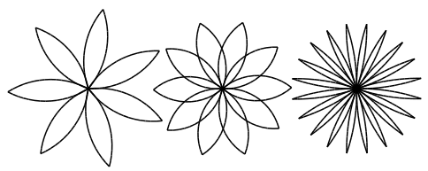
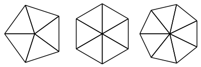

# 4 - Design de interface {#sec4}

[TOC]

# 4. Estudo de caso: design de interface {#sec4_}

# 4.1 O módulo turtle {#sec4_1}

# 4.2 Repetição simples {#sec4_2}

# 4.12 Exercícios {#sec4_12}

**Exercício 4.1.**

1. Desenhe

Figura 4.1 XXX

Figura 4.2 XXX

[Próxima página >>](@ref sec5)