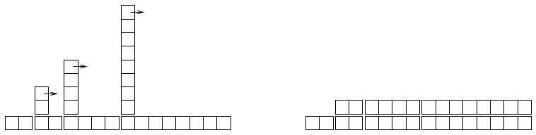

# Apêndice B - Análise de algoritmos {#secb}

[TOC]

Este apêndice é

# B.1 Order of growth {#secb_1}

Tamanho da entrada | Tempo XXX do Algoritmo A | Tempo XXX do Algoritmo B
------------------:|-------------------------:|------------------------:
                10 |                    1 001 |                      111
               100 |                   10 001 |                   10 101
             1 000 |                  100 001 |                1 001 001
            10 000 |                1 000 001 |        > 1010

Figura B.1 XXX

[Próxima página >>](@ref license)